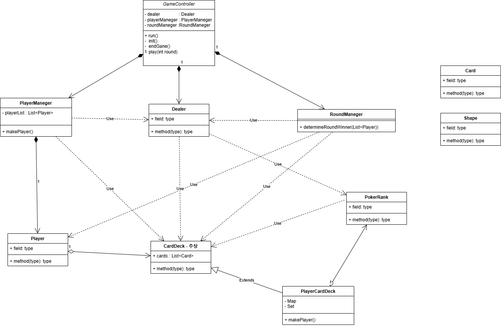

## 0. 설계 구조


## 1. 시작 가이드
>1. jdk 17버전
>2. 포커룰은 주어진 공식룰을 적용했습니다.
>2. Main 클래스에서 실행

## 2. 주요 기능
### GameController
게임 시작의 큰 틀입니다. 게임에 필요한 초기값 생성(플레이어, 딜러, 카드)을하고 게임 100판을 진행하고 최종 우승 순위를 보여 줍니다.

### PlayerManeger
플레이어들을 관리하는 클래스입니다. 플레이어들을 생성하고 딜러에게 받은 카드를 플레이어들에게 분배해줍니다.

### RoundManeger
라운드를 관리하는 클래스입니다. 라운드별 우승 플레이어를 결정해줍니다.

### CardDeck
추상 클래스로 구현체는 PlayerCardDeck입니다. 

### PlayerCardDeck
플레이어의 카드덱을 갖고 자신의 현재 포커 랭크와 페어카드, 탑 카드, 가장 큰 수, 모양등을 계산해주는 클래스입니다.

### PokerRank
13가지 족보를 갖고 있는 enum 클래스입니다. 추상메서드를 만들어서 같은 랭크일때 우승 카드덱을 반환하는 메서드를 갖고있습니다.

### Card, Player
카드와 플레이어의 정보를 갖고있는 데이터 클래스입니다.

### CardMaker, Consol
유틸 클래스입니다. Card 생성기와 Scanner입니다.

### Validator
제대로된 입력 값을 검증하는 클래스입니다. 플레이어 수, 길이, 이름 형식등을 확인 합니다.

### InputView, OutputView
입출력 클래스입니다.

🎮 게임 진행 방식
입력값으로 받은 멤버 수로 🎩 딜러와 함께 포커 게임을 100판 진행하고, 최종 승자를 가립니다.

🎲 게임의 준비 단계

숫자 입력
```
게임을 시작합니다.
플레이어 숫자를 입력하세요. : 5
플레이어 수는 2~4명을 입력해야 합니다.
플레이어 숫자를 입력하세요. : 4
```

닉네임 설정 중복, 20자 이상은 안됩니다.
```
플레이어 닉네임을 설정해주세요: 래먀너레ㅐ먀ㅓㅇ레ㅑㅐㅁ넝라먼레ㅑㅐㅓㅁㄴ;아ㅣ러ㅔㅁ너레ㅑ멍네ㅓㅁㅇ라ㅓ
이미 닉네임이 있거나 형식이 틀렸습니다. 다시 입력하세요. 
EX) 1~20자 그리고 공백은 안됩니다.플레이어 닉네임을 설정해주세요: 한얼
플레이어 닉네임을 설정해주세요: 한얼
닉네임 중복되었습니다. 다시 입력하세요
```
올바른 닉네임 입력
```
플레이어 닉네임을 설정해주세요: 한얼
플레이어 닉네임을 설정해주세요: 재홍
플레이어 닉네임을 설정해주세요: 진호
플레이어 닉네임을 설정해주세요: 병중
```

🚀 게임의 진행 단계
🏁 매치를 시작합니다.
```
1라운드 
한얼                    High Card              카드덱 [[♦] 6 , [♦] 7 , [♥] 8 , [♣] 9 , [♠] 11] 우승 횟수: 0
재홍                    High Card              카드덱 [[♣] 5 , [♣] 7 , [♦] 9 , [♥] 10, [♥] 13] 우승 횟수: 0
진호                    One Pair               카드덱 [[♦] 2 , [♠] 3 , [♣] 8 , [♥] 12, [♣] 12] 우승 횟수: 0
============= 이번 1라운드 우승자 ============= 
병중                    Two Pair               카드덱 [[♣] 2 , [♥] 2 , [♥] 4 , [♥] 9 , [♠] 9 ] 우승 횟수: 1

2라운드
...
```
---
💀 포커 100판 진행 💀

---
🔍 매치 결과:
```
=========== 게임 종료 플레이어 결과 리스트 ===========
1등 player병중                    카드덱 [[♥] 7 , [♠] 9 , [♥] 9 , [♣] 10, [♣] 12] 우승 횟수: 36
2등 player한얼                    카드덱 [[♥] 2 , [♥] 4 , [♠] 5 , [♠] 12, [♥] 12] 우승 횟수: 25
3등 player재홍                    카드덱 [[♠] 3 , [♠] 8 , [♦] 10, [♠] 11, [♦] 12] 우승 횟수: 22
4등 player진호                    카드덱 [[♣] 1 , [♣] 3 , [♦] 3 , [♦] 9 , [♦] 13] 우승 횟수: 17
```